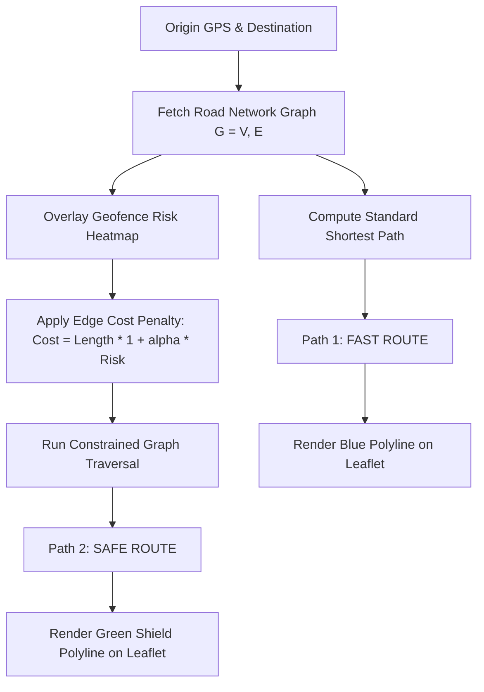

# 🛡️ SafePath V1 — Architecture & Technical Specification Document
**Engineering Baseline & Technical Reference for SafePath-X (National Tourism Safety Infrastructure)**

---

## 1. Executive System Overview & Architecture

SafePath V1 is a multi-tier **Smart Tourist Safety Monitoring, Geofencing, and Incident Response Platform**. It bridges client-side real-time GPS telemetry, cloud persistence, spatial risk analysis, and an administrative authority command portal.

```
┌──────────────────────────────────────────────────────────────────────────────────────────────────┐
│                                         CLIENT LAYER                                             │
│  ┌───────────────────────────────┐     ┌──────────────────────────────────────────────────────┐  │
│  │   Tourist Mobile Web App      │     │         Authority Command & Control Center           │  │
│  │ (/dashboard, /digital-id)     │     │             (/dashboard/authority)                   │  │
│  └──────────────┬────────────────┘     └──────────────────────────▲───────────────────────────┘  │
└─────────────────┼─────────────────────────────────────────────────┼──────────────────────────────┘
                  │ HTTPS / WSS                                     │ Real-time Snapshot / Broadcast
                  ▼                                                 │
┌───────────────────────────────────────────────────────────────────┼──────────────────────────────┐
│                            EDGE / API & PERSISTENCE LAYER         │                              │
│  ┌─────────────────────────────────────┐      ┌───────────────────┴───────────────────────────┐  │
│  │       Next.js 15 App Router         │      │             Cloud Firestore                   │  │
│  │  - Serverless Route Handlers        │◄────►│  - active_tourists (Live GPS stream)          │  │
│  │  - Reverse Geocode Caching Engine   │      │  - authority_notifications (Zone transitions) │  │
│  │  - JWT & Bcrypt Auth Fallbacks      │      │  - safety_zones (National GIS registry)       │  │
│  └──────────────────┬──────────────────┘      └───────────────────▲───────────────────────────┘  │
└─────────────────────┼─────────────────────────────────────────────┼──────────────────────────────┘
                      │ Internal RPC / REST                         │ Async Push
                      ▼                                             │
┌───────────────────────────────────────────────────────────────────┼──────────────────────────────┐
│                       PYTHON SPATIAL RISK & ML MICROSERVICE       │                              │
│  ┌────────────────────────────────────────────────────────────────┴───────────────────────────┐  │
│  │  - Spatio-Temporal Risk Scoring Engine (Kernel Density Estimation + Decay Models)           │  │
│  │  - Dynamic Safe Route Graph Traversal (Penalized Cost Dijkstra / A*)                       │  │
│  │  - Anomaly & Deviation Detector (Sudden route deviation / Dwell-time breaches)             │  │
│  └────────────────────────────────────────────────────────────────────────────────────────────┘  │
└──────────────────────────────────────────────────────────────────────────────────────────────────┘
```

---

## 2. Core Tech Stack & Layer-by-Layer Architecture

### 2.1 Technology Matrix

| Layer | Component | Implementation Details |
| :--- | :--- | :--- |
| **Frontend UI / UX** | Next.js 15.5.3 (App Router), React 19.1.0 | Server-side rendered wrappers with dynamic client components, Tailwind CSS v4, Lucide Icons, Framer Motion. |
| **Client GIS Engine** | Leaflet 1.9.4 + OpenStreetMap Tiles | Dynamic browser injection (`window.L`), custom canvas overlay renderers, interactive vector polygons and circles. |
| **Cloud Telemetry & Sync** | Firebase 12 (Firestore & Auth) | Web SDK `onSnapshot` real-time listeners, `setDoc` upserts with merge strategies, `BroadcastChannel` local IPC for zero-latency multi-tab sync. |
| **Spatial Risk Backend** | Python (FastAPI / Flask Microservice) | SciPy/NumPy spatial matrix calculations, Shapely geometry validation, NetworkX/OSRM graph cost adjustments. |
| **Identity & Security** | Web Crypto / UUIDv4 / QRCode.react | SHA-256 digest calculation for simulated immutable tourist ID ledgers and instant camera validation. |

---

### 2.2 Frontend-to-Backend Communication Protocols

1. **Telemetry Streaming (Tourist ➔ Server)**:
   - The tourist client captures continuous GPS coordinates via `navigator.geolocation.watchPosition` with `enableHighAccuracy: true`.
   - Coordinates are pushed at throttled intervals (3–5 seconds) via Firebase Firestore document sync (`active_tourists/{userId}`) and local inter-process channels (`BroadcastChannel('safepath_live_stream')`).
2. **Authority Real-Time Feed (Server ➔ Police Command Portal)**:
   - The Authority portal subscribes directly to Firestore collection snapshots (`onSnapshot`) and broadcast events.
   - When a tourist's coordinate breaches a geofenced bounding box, an event payload (`ZoneTransitionEvent`) is dispatched immediately to the authority live ticker without requiring polling.
3. **Python Spatial Microservice Integration**:
   - The Next.js API layer forwards coordinate arrays and route origins/destinations to the Python backend via internal HTTP REST endpoints:
     - `POST /api/v1/risk-score`: Computes composite risk index for a given coordinate and timestamp.
     - `POST /api/v1/safe-route`: Returns waypoints for the path that minimizes exposure to high-risk zones.
     - `POST /api/v1/anomaly-check`: Ingests breadcrumb trajectories to identify stationary distress, abnormal deviations, or geofence boundary breaches.

---

## 3. Routing & Mapping Engine Logic

### 3.1 Leaflet Integration & Layering

SafePath dynamically boots the Leaflet GIS engine on the client to avoid Next.js Server-Side Rendering (SSR) hydration crashes:

```
[Layer 0] OpenStreetMap Raster Tile Layer (Base Map)
    │
[Layer 1] Geofenced Zone Polygons & Risk Buffers (GeoJSON / L.polygon / L.circle)
    │   ├── 🟢 Green (Safe): Opacity 0.25, Solid Border (#10B981)
    │   ├── 🟡 Yellow (Caution): Opacity 0.25, Solid Border (#F59E0B)
    │   └── 🔴 Red (Danger): Opacity 0.30, Dashed Border [5, 5] (#EF4444)
    │
[Layer 2] Routing Polylines (Fast Route vs Safe Route)
    │
[Layer 3] Live Tourist GPS Beacons with Pulsing CSS Accuracy Circles (L.divIcon)
```

---

### 3.2 Dual-Path Calculation: "Fast Route" vs "Safe Route"

SafePath solves the multi-objective pathfinding problem by modifying standard road network routing (OSRM / Dijkstra / A*):



#### Mathematical Formulation:

1. **Standard Fast Route**:
   $$\min \sum_{e \in P} \text{Length}(e)$$
2. **Safe Route (Risk-Penalized Traversal)**:
   For every road edge $e$ intersecting a caution or danger zone buffer, an exponential safety penalty is applied:
   $$C(e) = \text{Length}(e) \cdot \left(1 + \alpha \cdot \mathcal{R}(e)\right)$$
   - $\text{Length}(e)$: Physical road segment distance in meters.
   - $\mathcal{R}(e) \in [0, 10]$: Normalized Spatial-Temporal Risk Index of the road segment.
   - $\alpha$: Risk sensitivity multiplier (default $\alpha = 2.5$).
   - If an edge intersects a **Danger Zone (Red)** after curfew hours, $C(e) \to \infty$, forcing the pathfinder to navigate around the perimeter.

---

### 3.3 Boundary Detection Algorithms

1. **Ray-Casting Point-in-Polygon (Jordan Curve Theorem)**:
   Used for arbitrary multi-corner campus boundaries (e.g., Sharda University Agra Main Campus):
   $$\text{Intersect} = \left( (y_i > y) \neq (y_j > y) \right) \land \left( x < \frac{(x_j - x_i)(y - y_i)}{y_j - y_i} + x_i \right)$$
   An odd number of boundary intersections confirms the tourist is inside the polygon.
2. **Haversine Geodesic Distance**:
   Used for radial buffer zones (e.g., Keetham Lake Reserve Forest, Taj Mahal Protected Tier):
   $$a = \sin^2\left(\frac{\Delta\phi}{2}\right) + \cos(\phi_1)\cos(\phi_2)\sin^2\left(\frac{\Delta\lambda}{2}\right), \quad d = 2R \cdot \text{atan2}\left(\sqrt{a}, \sqrt{1-a}\right)$$

---

## 4. Risk Scoring, Heatmaps & Data Pipeline

### 4.1 Spatio-Temporal Composite Risk Scoring Formula

The risk engine computes a continuous safety score $S(x, y, t) \in [0, 100]$:

$$\mathcal{R}(x, y, t) = w_1 \cdot \mathcal{C}_{\text{crime}}(x, y) + w_2 \cdot \mathcal{L}_{\text{lighting}}(x, y, t) + w_3 \cdot \mathcal{D}_{\text{crowd}}(x, y, t) + w_4 \cdot \mathcal{T}_{\text{terrain}}(x, y) - w_5 \cdot \mathcal{P}_{\text{police}}(x, y)$$

$$\text{SafetyScore}(x, y, t) = 100 - \min\left(100, \; 10 \cdot \mathcal{R}(x, y, t)\right)$$

```
┌─────────────────────────┬────────┬────────────────────────────────────────────────────────┐
│ Feature / Parameter     │ Weight │ Operational Meaning                                    │
├─────────────────────────┼────────┼────────────────────────────────────────────────────────┤
│ C_crime (Historical)    │ 0.35   │ Historical incident density (FIR/theft/harassment logs)│
│ L_lighting (Temporal)   │ 0.20   │ Street light coverage multiplied by night-time factor  │
│ D_crowd (Density)       │ 0.15   │ Congestion index / Isolated alleyway factor            │
│ T_terrain (Hazard)      │ 0.10   │ Marshy wetlands, riverbed cliffs, deep forest trails   │
│ P_police (Mitigation)   │ 0.20   │ Proximity to active Police Outposts, CISF, CCTV kiosks │
└─────────────────────────┴────────┴────────────────────────────────────────────────────────┘
```

---

### 4.2 Spatial Heatmap Pipeline

1. **Kernel Density Estimation (KDE)**:
   Historical incident points are weighted and smoothed across a 2D Gaussian kernel:
   $$\hat{f}(x, y) = \frac{1}{n h^2 2\pi} \sum_{i=1}^n \exp\left( -\frac{d((x,y), (x_i, y_i))^2}{2h^2} \right)$$
   Where $h$ is the bandwidth radius (typically 250m–500m).
2. **Dynamic Time Multipliers**:
   Between 18:00 and 06:00, lighting and visibility weights increase risk in unlit areas (e.g., Keetham Reserve Forest drops from Level 5 to Level 2 Danger).

---

## 5. User & Authority Feature Specifications

```
                       ┌────────────────────────────────────────────────────────┐
                       │                   SAFEPATH SUITE                       │
                       └───────────┬────────────────────────────────┬───────────┘
                                   │                                │
                ┌──────────────────┴───────────────┐   ┌────────────┴──────────────────────┐
                ▼                                  ▼   ▼                                   ▼
      TOURIST CLIENT FEATURES                     AUTHORITY & POLICE COMMAND ROOM
  • Live GPS Tracking & Accuracy Radar         • Real-Time Multi-User Radar Map
  • Exact Reverse-Geocoded Street Address      • Automated Zone Analyser Event Stream
  • Dynamic Zone Status (Safe/Caution/Danger)  • 1-Click Electronic FIR (E-FIR) Generator
  • 1-Tap SOS Emergency Panic Dispatch         • Live Tourist Breadcrumbs & Emergency Contacts
  • Digital Tourist ID (UUID + Blockchain Hash)• High-Risk Zone & Curfew Management
  • 3D / AR Monument Virtual Experience        • Police & Ambulance Fast-Dispatch Linkage
```

### 5.1 Primary User Features

1. **Zone Analyser & Live GPS Tracking**:
   - Continuously monitors location against national and campus zones.
   - Converts coordinates into precise street addresses via cached reverse geocoding.
   - Displays real-time risk factors, guidelines, and localized helplines.
2. **Digital Tourist ID & QR Security**:
   - Issues a unique Tourist ID (`TID-XXXXXX`), validity timestamp, and cryptographic hash (`0x...`).
   - Renders a verifiable SVG QR code for verification by authorities and security checkpoints.
3. **Instant SOS Panic Trigger**:
   - Immediately captures high-accuracy coordinates and dispatches distress flags to the authority room and emergency contacts.
4. **AR Monument Guide**:
   - Web-based 3D/AR inspection of monuments with historical eras, architecture details, and audio guides.

---

### 5.2 Authority Command Center Features

1. **Live Multi-User Fleet Radar**:
   - Concurrently renders all active online tourists on a map with colored status indicators (Green for Safe, Amber for Caution, Red/Flashing for Panic).
2. **Real-Time Notification Feed**:
   - Auto-updating event stream logging every zone entry/exit (*"Aditya Kaushik ENTERED Sharda University Agra Main Campus at 14:32"*).
3. **Electronic First Information Report (E-FIR) Engine**:
   - Generates an official printable PDF/e-document with auto-filled tourist metadata, exact timestamp, coordinates, address, and reporting police station.

---

## 6. Technical Limitations & Bottlenecks (V1 Baseline)

To scale SafePath from an SIH prototype into **SafePath-X (a National Tourism Safety Infrastructure)**, the following limitations must be addressed:

```
┌──────────────────────────────────────┬────────────────────────────────────────────────────────┐
│ V1 Limitation / Bottleneck           │ SafePath-X Architectural Remedy                        │
├──────────────────────────────────────┼────────────────────────────────────────────────────────┤
│ 1. Client-Side Geofence Evaluation   │ Server-side Geospatial Indexing (PostGIS / Uber H3     │
│    - Evaluates polygons in browser;  │ spatial hexagons) to process millions of concurrent    │
│      drains mobile battery.          │ background GPS points.                                 │
├──────────────────────────────────────┼────────────────────────────────────────────────────────┤
│ 2. Reverse Geocoding Rate Limits     │ Distributed In-Memory Geocoding (Self-hosted Nominatim │
│    - Relies on OSM Nominatim API     │ / Pelias instance with Redis spatial caching layer).   │
│      capped at 1 req/sec.            │                                                        │
├──────────────────────────────────────┼────────────────────────────────────────────────────────┤
│ 3. Database Write Contention         │ High-Throughput Telemetry Pipeline (Apache Kafka /     │
│    - Firestore document writes limit │ MQTT Broker ➔ TimescaleDB / ClickHouse for timeseries   │
│      to 1 write/sec per document.    │ trajectory logs).                                      │
├──────────────────────────────────────┼────────────────────────────────────────────────────────┤
│ 4. Background Execution on Mobile    │ Native Progressive Web App (PWA) Background Geolocation│
│    - Web browsers throttle JS when   │ Service / Native Android & iOS Background Daemons with │
│      the screen is locked.           │ low-power geofencing hardware APIs.                    │
├──────────────────────────────────────┼────────────────────────────────────────────────────────┤
│ 5. Routing Engine Hardcoding         │ Dedicated OSRM / Valhalla Graph Server customized with │
│    - Relies on default road graphs   │ dynamic real-time hazard weight matrices.              │
│      without live traffic/police feeds│                                                        │
├──────────────────────────────────────┼────────────────────────────────────────────────────────┤
│ 6. Simulated Blockchain Ledger       │ Hyperledger Fabric / Polygon State L2 for immutable    │
│    - ID hashes generated on client.  │ tourist registration & verified government authority   │
│                                      │ credentials.                                           │
└──────────────────────────────────────┴────────────────────────────────────────────────────────┘
```

---

## 7. Strategic Recommendations for SafePath-X Architecture

1. **Adopt Spatial Partitioning (Uber H3 Indexing)**:
   - Partition all of India into H3 Resolution-9 (~100m) hexagonal cells. Every cell stores a pre-computed dynamic risk score in Redis. Lookups for GPS coordinates become $O(1)$ constant time.
2. **Event-Driven Telemetry Ingestion (Kafka / MQTT)**:
   - Route GPS updates through a lightweight MQTT broker / Kafka topic. Consumer workers run batch boundary checks without hitting primary database write limits.
3. **Dedicated Self-Hosted GIS Infrastructure**:
   - Deploy self-hosted Valhalla / OSRM routing instances equipped with dynamic edge cost penalty plugins.
4. **Official Emergency Services Integration**:
   - Integrate with India Emergency Response Support System (ERSS 112) APIs for direct dispatch capabilities.
